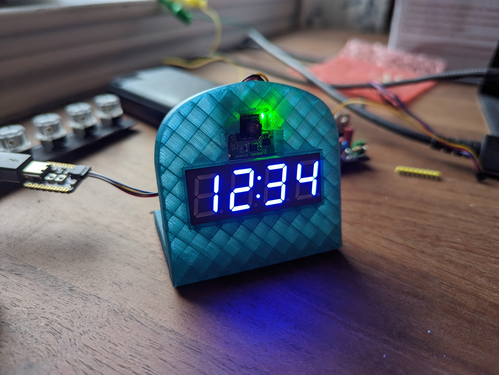
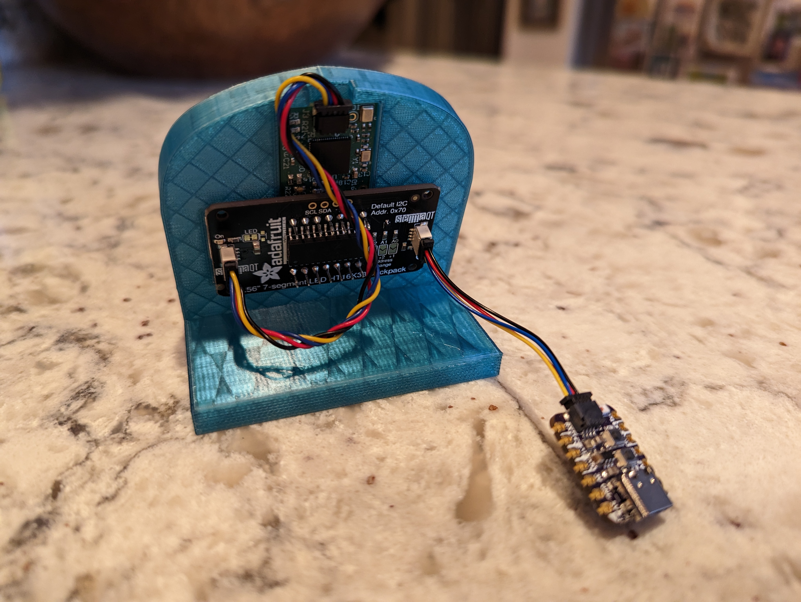

# Clock That Is Wrong

A 7-Segment Clock that displays the wrong time when it detects someone looking at it.

{ [Twitter Demo](https://twitter.com/gvy_dvpont/status/1627877417044918272) }

## Hardware

You will need:
- [Adafruit QT Py ESP32-S2 dev board](https://www.adafruit.com/product/5325) (or any ESP board with a STEMMA QT connector)
- [Person Sensor](https://usefulsensors.com/person-sensor/)
- [Adafruit 7-Segment Display with I2C backpack](https://www.adafruit.com/product/878) (any color)
- [2 STEMMA QT/ Qwiic Cables](https://www.adafruit.com/product/4399) (one should be > 50mm)
- (optional) Filament to 3D print the [case](case_stand.stl).

### Wiring 

1. Connect the Person Sensor to the 7-Segment backpack using a STEMMA QT cable.
2. Connect the ESP-32 dev board to the other STEMMA QT port.

## Software

1. Get CircuitPython [running on your dev board](https://learn.adafruit.com/adafruit-qt-py-esp32-s2/circuitpython).
2. Install the following libraries:
   1. `adafruit_ht16k33` (from the adafruit library bundle)
   2. `adafruit_requests.mpy` (from the adafruit library bundle)
   3. `adafruit_ticks.mpy` (from the adafruit library bundle)
   4. [`person_sensor`](https://github.com/dupontgu/person-sensor-circuitpython)
3. Load this repo's [`code.py`](code.py) file onto the dev board.
4. Edit the timezone, wifi ssid, and password at the top of that file to fit your needs.
5. That should be it!